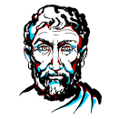

# http://denker-dev.github.io

<!DOCTYPE html>
<html lang="pt-br">
  <head>
    <meta charset="utf-8">
    <title>Denker-Home</title>
    <meta name="viewport" content="width=device-width,initial-scale=1">
    <link rel="stylesheet" type="text/css" href="styledenkerdev.css">
  </head>
  <body style="font-family: 'Trebuchet MS', 'Lucida Sans Unicode', 'Lucida Grande', 'Lucida Sans', Arial, sans-serif; background-color: rgba(110, 2, 173, 0.919); box-shadow: 0vw -10vw -20vw rgba(2, 245, 144, 0.964)">
    

        
  <h1>Denker dev</h1>
  <h2>I am a website developer with the intensity of reporting
absurd things that happen in the world!</h2>
  <h3>Visit me on my social pages:</h3>
  <ul id="sigah">
    <li style="margin-left: -40px;display: inline-block;"></li>
    <li style="margin-bottom:4vw; display: inline-block;"></li>
  </ul>
  
    

    <ul id= "entre" style="text-align: center; list-style: none;">
        <li style="text-align: center; display: inline-block;">
            
<figcaption style="text-decoration: none; text-align: center; font-size: 2.5vw; color: rgba(79, 0, 124, 0.919);">polio still exists?</figcaption>

        </li>
        <!--<li style="display: inline-block;">
            

                
                <figcaption style="text-align: center; font-size: 2.5vw;">NOME</figcaption>

        </li>
        <li style="display: inline-block;">
            

                
                <figcaption style="text-align: center; font-size: 2.5vw;">NOME</figcaption>

        </li> -->

        
        
    </ul>

  </body>
  <footer style="margin-left: -10px; margin-right: -8px; background-color: rgba(2, 245, 144, 0.964); padding-top: 0.4vw; border-top: rgba(79, 0, 124, 0.919) 0.4vw solid; margin-bottom: -18vw;">
    
<strong>Email: denkerrdev@gmail.com</strong>

    
</footer>
</html>
